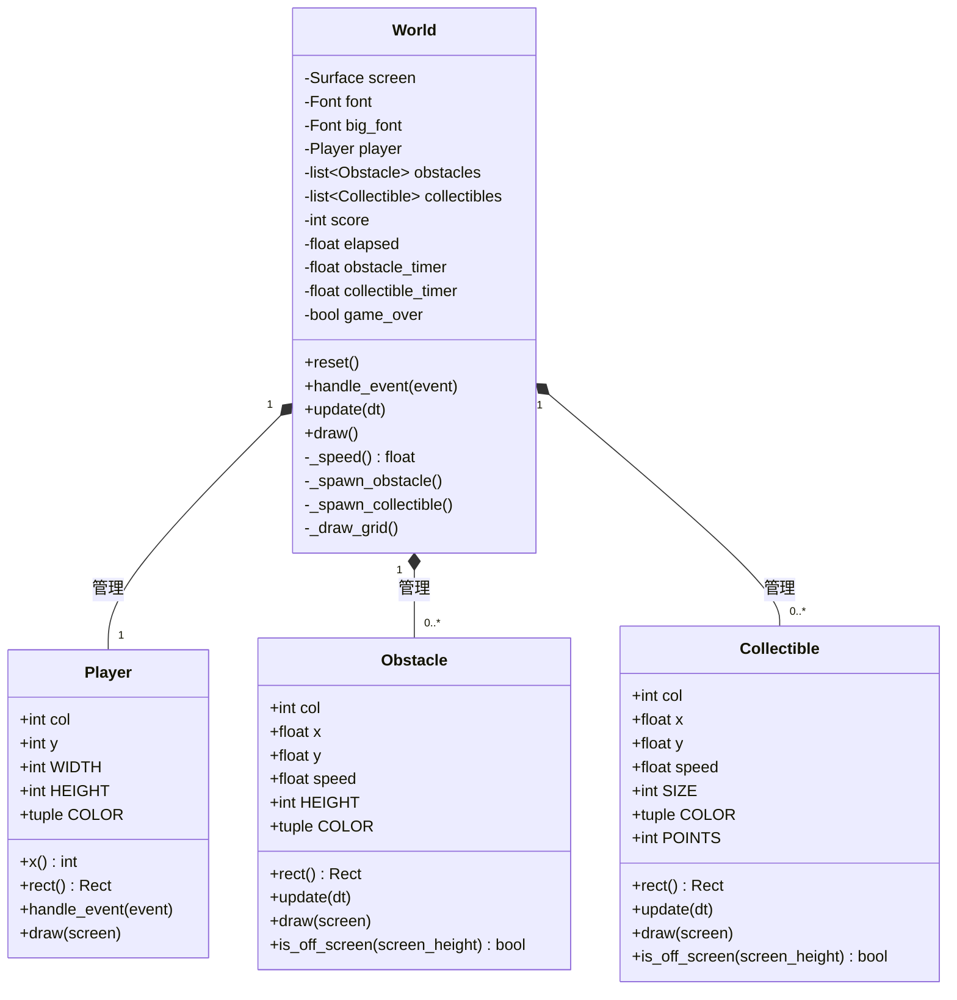
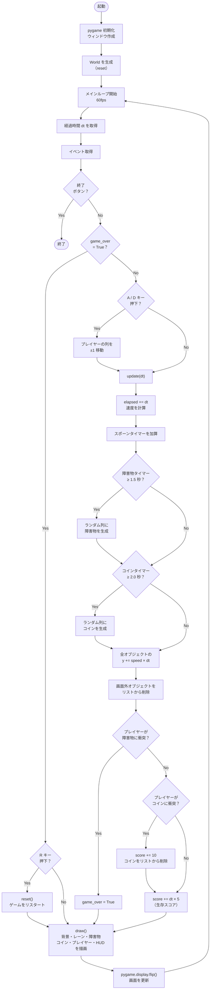

# Vertical Dash ― UML 図

## クラス図

```mermaid
classDiagram

    class World {
        -Surface screen
        -Font font
        -Font big_font
        -Player player
        -list~Obstacle~ obstacles
        -list~Collectible~ collectibles
        -int score
        -float elapsed
        -float obstacle_timer
        -float collectible_timer
        -bool game_over
        +reset()
        +handle_event(event)
        +update(dt)
        +draw()
        -_speed() float
        -_spawn_obstacle()
        -_spawn_collectible()
        -_draw_grid()
    }

    class Player {
        +int col
        +int y
        +int WIDTH
        +int HEIGHT
        +tuple COLOR
        +x() int
        +rect() Rect
        +handle_event(event)
        +draw(screen)
    }

    class Obstacle {
        +int col
        +float x
        +float y
        +float speed
        +int HEIGHT
        +tuple COLOR
        +rect() Rect
        +update(dt)
        +draw(screen)
        +is_off_screen(screen_height) bool
    }

    class Collectible {
        +int col
        +float x
        +float y
        +float speed
        +int SIZE
        +tuple COLOR
        +int POINTS
        +rect() Rect
        +update(dt)
        +draw(screen)
        +is_off_screen(screen_height) bool
    }

    World "1" *-- "1" Player : 管理
    World "1" *-- "0..*" Obstacle : 管理
    World "1" *-- "0..*" Collectible : 管理
```

---

## アクティビティ図

```mermaid
flowchart TD
    Start([起動]) --> Init["pygame 初期化\nウィンドウ作成"]
    Init --> CreateWorld["World を生成\n（reset）"]
    CreateWorld --> Loop["メインループ開始\n60fps"]

    Loop --> GetDT["経過時間 dt を取得"]
    GetDT --> Events["イベント取得"]

    Events --> Quit{終了\nボタン？}
    Quit -- Yes --> End([終了])
    Quit -- No --> GameOver1{game_over\n= True？}

    GameOver1 -- Yes --> KeyR{R キー\n押下？}
    KeyR -- Yes --> Reset["reset()\nゲームをリスタート"]
    Reset --> Draw
    KeyR -- No --> Draw

    GameOver1 -- No --> KeyAD{A / D キー\n押下？}
    KeyAD -- Yes --> MoveCol["プレイヤーの列を\n±1 移動"]
    MoveCol --> Update
    KeyAD -- No --> Update

    Update["update(dt)"]
    Update --> AddTime["elapsed += dt\n速度を計算"]
    AddTime --> SpawnTimer["スポーンタイマーを加算"]

    SpawnTimer --> ObsTimer{障害物タイマー\n≥ 1.5 秒？}
    ObsTimer -- Yes --> SpawnObs["ランダム列に\n障害物を生成"]
    SpawnObs --> ColTimer
    ObsTimer -- No --> ColTimer

    ColTimer{コインタイマー\n≥ 2.0 秒？}
    ColTimer -- Yes --> SpawnCol["ランダム列に\nコインを生成"]
    SpawnCol --> MoveObjs
    ColTimer -- No --> MoveObjs

    MoveObjs["全オブジェクトの\ny += speed × dt"]
    MoveObjs --> Remove["画面外オブジェクトを\nリストから削除"]
    Remove --> HitObs{プレイヤーが\n障害物に衝突？}

    HitObs -- Yes --> SetGO["game_over = True"]
    SetGO --> Draw
    HitObs -- No --> HitCol{プレイヤーが\nコインに衝突？}

    HitCol -- Yes --> AddScore["score += 10\nコインをリストから削除"]
    AddScore --> TimeScore
    HitCol -- No --> TimeScore

    TimeScore["score += dt × 5\n（生存スコア）"]
    TimeScore --> Draw

    Draw["draw()\n背景・レーン・障害物\nコイン・プレイヤー・HUD を描画"]
    Draw --> Flip["pygame.display.flip()\n画面を更新"]
    Flip --> Loop
```
